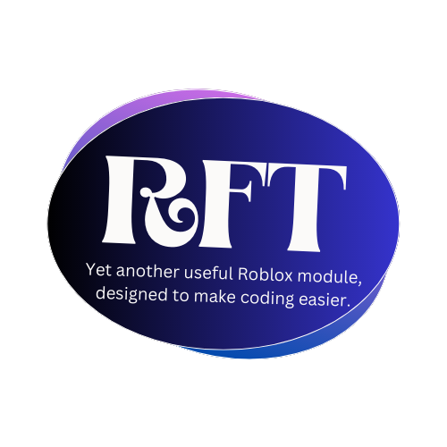

<h1>Reformatt: (version v1.0)</h1>

Yet another useful Roblox module, designed to make coding easier.

## Features
Thanks for choosing Reformatt. Here's some of the things you opted in for. Hold onto something, cause this is a long ride!
* **rft:Find() and rft:Touch()** - Already existing Roblox events, but Reformatted
* **rft:FindPlayerByHumanoid()** - Pretty self-explanatory
* **rft:RandomPos()** - Positions an instance in a random position inside a region, but there's more: **it even tweens!**
* **rft:RandomSize()** - Sizes an instance in with a random size between two values, but guess what: **this tweens too!**
* **rft:RandomColor()** - Changes the color of an instance to a random color between two values
* **rft:KillBrick()** - Make easy obstacles with this function. Just call it and it gets the job done
* **rft:SetPrecision()** - Ever used C++? This changes the precision point to a custom number of decimals
* **rft:Abbreviate()** - Have long numbers and want to shorten them a little? This function turns your numbers into shorter ones like 2K or 5M
* **rft:Countdown()** - Tired of writing long loops for countdowns? With a simple call, this does it all, counting down, so that you don't have to
* **rft:Overhead()** - Inserts an overhead tag on the specified Player's head!
* **rft:Notify()** - Sends a notification to the specified Player, make sure not to forget the message!
* **rft:Ragdoll()** - Pretty self-explanatory
* **rft:Tween()** - Tweens any instance however you want, without the need for extra code
* **rft:ApplyTextEffects()** - Applies custom text animations to any StringValues or UI elements such as: typewriter, fade, zoom, bounce, etc.
* **rft:HttpRequest()** - Pings a web server, methods: GET/POST
*  **rft:GenerateMap()** - Generates a random map based on a heightmap made of parts with customizeable dimensions!
*  **rft:GenerateTerrain()** - Generates a random map based on a heightmap made of smooth terrain!
*  **rft:ApplyUIEffect()** - Applies custom UI effects to any UI elements such as: UI particles, UI rainbow gradients, UI rainbow colors, UI shadows, etc.
*  **rft:NewUIElement()** - Inserts new UI elements such as: sliders, checkboxes, radio buttons, etc.
* And more... (check out the wiki for the full list) 

<h1>Reformatt: (version v1.0)</h1>

For the model or extra documentation, follow the links below:

